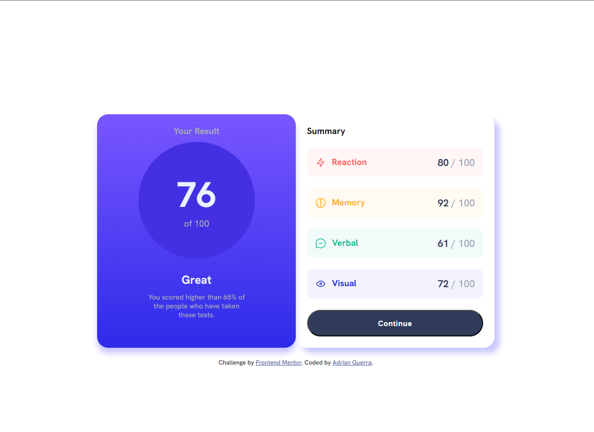

# Frontend Mentor - Results summary component solution

This is a solution to the [Results summary component challenge on Frontend Mentor](https://www.frontendmentor.io/challenges/results-summary-component-CE_K6s0maV). Frontend Mentor challenges help you improve your coding skills by building realistic projects. 

## Table of contents

- [Overview](#overview)
  - [The challenge](#the-challenge)
  - [Screenshot](#screenshot)
  - [Links](#links)
- [My process](#my-process)
  - [Built with](#built-with)
  - [What I learned](#what-i-learned)
  - [Continued development](#continued-development)
- [Author](#author)


## Overview

### The challenge

Users should be able to:

- View the optimal layout for the interface depending on their device's screen size
- See hover and focus states for all interactive elements on the page

### Screenshot



### Links

- Solution URL: [Add solution URL here](https://your-solution-url.com)
- Live Site URL: [https://results-summary-component-sigma.vercel.app/](https://results-summary-component-sigma.vercel.app/)

## My process

### Built with

- Semantic HTML5 markup
- CSS custom properties
- Sass
- Flexbox
- CSS Grid
- Mobile-first workflow

### What I learned

I learned how to use Sass/Scss, which I found to be really convenient.

```css
@mixin box-theme($color, $bg-color) {
    color: $color;
    background-color: $bg-color;
}

#item-one {
    @include box-theme($light-red, $bg-light-red);
}

#item-two {
    @include box-theme($orangey-yellow, $bg-orangey-yellow);
}

#item-three {
    @include box-theme($green-teal, $bg-green-teal);
}

#item-four {
    @include box-theme($cobalt-blue, $bg-cobalt-blue);
}
```

I used the CSS above to uniquely style each box with its own color and background color.  

### Continued development

I want to continue focusing on CSS grid, Sass, and RWD.


## Author

- LinkedIn - [Adrian Guerra](https://www.linkedin.com/in/adrian-guerra-a210a4196/)
- Frontend Mentor - [@adie9](https://www.frontendmentor.io/profile/adie9)


